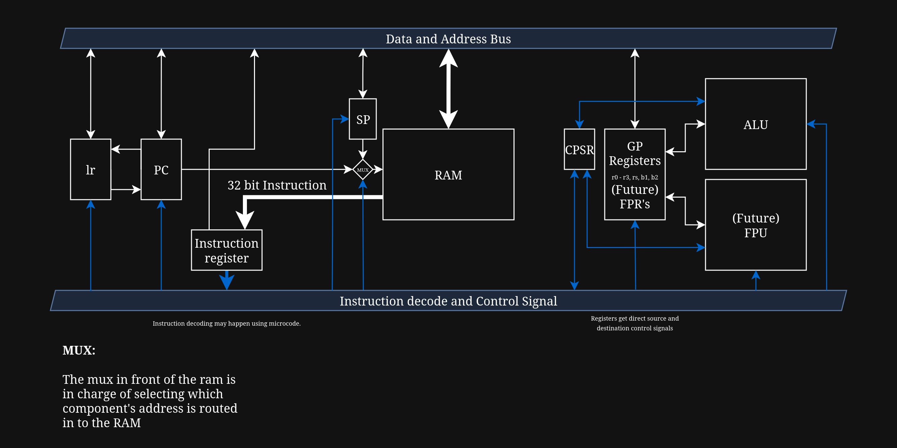

# Architecture overview
In this Document, you will learn about my decision on certain aspects of the architecture. Such as my choice for implementing certain concepts on the hardware level and integration with the ISA  

---
### High Level Description: an overview for VELA-8 R (RISC Like)  
VELA-8 is an 8 bit data, 16 bit address line CPU. The VELA-8 R Architecture is a RISC-like setup with a fixed length instruction using a shared instruction/data memory setup (Von Neumann architecture).  

---
### Component Overview  
The CPU will contain a basic set of components. Control Unit, Registers (also see [Registers](/Docs/registers.md)), ALU, Memory, Data and Address Bus, Control wiring.  

---
### Block diagram  

---
### Data Flow  
VELA-8 R is going to use a very basic data flow layout. Fetch -> Decode -> Execute.
Per instruction cycle: PC address -> Fetching Instructions -> Decode instruction -> Sets Control Signals according to Operands and args -> Loads imms or memory in to Registers or stores values from registers in to memory or other registers.  
